# UFC Data Platform – End-to-End ELT Pipeline with Airflow

## Overview

This project implements an end-to-end Data Engineering pipeline for UFC fight data that can be used for various downstream cases. The system crawls fight statistics, stores raw data in a data lake, transforms it into a dimensional warehouse using an ELT approach, and exposes it through a serving layer used for analytics and machine learning. The entire infrastructure can be run locally using Docker, making the platform fully reproducible without requiring cloud resources. The pipeline is orchestrated with Airflow and supports both full and incremental loading strategies.

**Tech Stack:**
- Airflow
- Scrapy/Scrapyd
- PostgreSQL
- MinIO
- Docker
- PowerBI

**Key Concepts:**
- ELT pipeline
- Dimensional modeling
- SCD Type-2
- Incremental loading
- Data lake → warehouse architecture
- Reporting

## Architecture

The high-level architecture diagram of this repository, can be seen in the below picture:

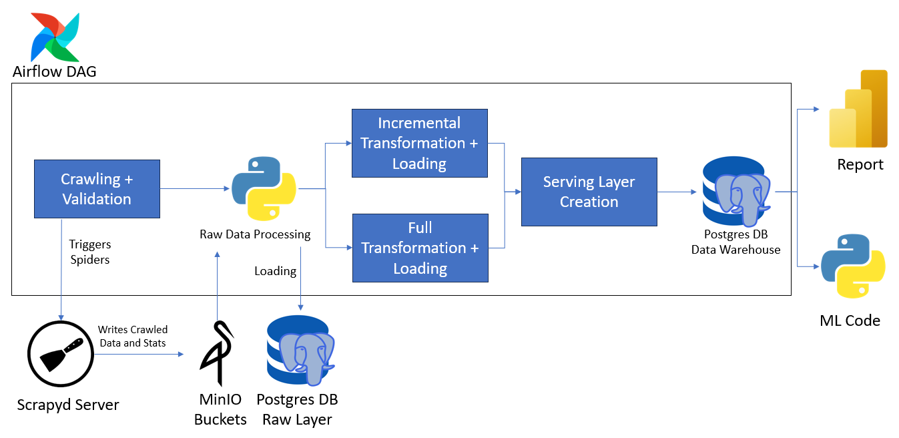

The architecture consists of the following stages:

1. The pipeline triggers the crawling spiders using the Scrapyd Server and when the jobs finish, the spiders store the crawled data and the stats into the relevant MinIO buckets. Scrapyd manages spider execution while ScrapydWeb provides a UI for deployment and monitoring.
2. Then a small preprocessing step is performed in Python for tasks that are easier outside SQL (e.g., gender detection).
3. Once raw data are loaded into the landing tables, the pipeline proceeds to execute the necessary SQL Scripts in order to start building the raw layer and then the Data Warehouse and the Serving Views. The Data Model and the two Loading modes will be discussed in the next sections.
4. Then the Data Warehouse Tables and Serving Views are used by the PowerBI Report and the Machine Learning Code, respectively.

## Data Model

The below image contains the Data Model for our warehouse:

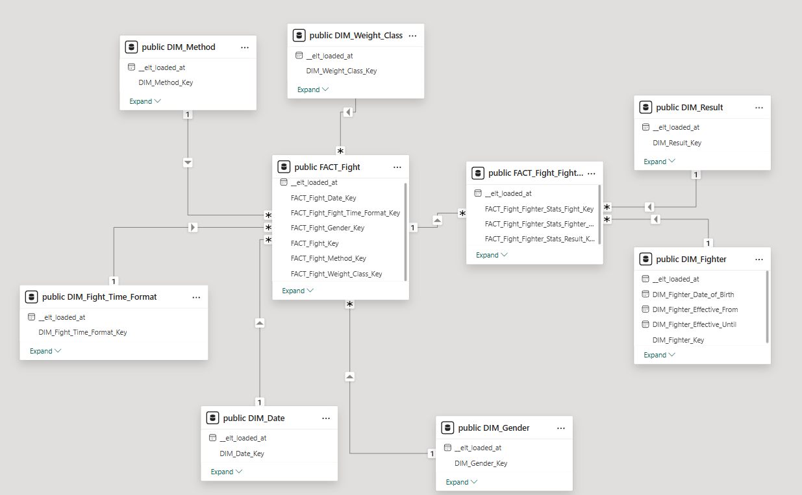

Following Kimball dimensional modeling approach to create the Data Model, we have the following:

**Business Process**: A UFC Fight that happens on a specific Date between 2 fighters.

**Granularity**: One row per fight that will contain general fight's stats and one row per fight and fighter that will contain fighter's performance in the fight.

**Dimensions**: I created the following Dimension Tables:
- **Result**: The result of the fight(win, lose, draw). In the Fact table this value is based on Fighter's 1 POV.
- **Weight Class**: The weight class of the fight
- **Date**
- **Fight Time Format**: In essence this shows if the fight is 3 or 5 rounds.
- **Method**: Finish method like Submission, TKO etc.
- **Gender**: The Gender of the fighters involved in the fight
- **Fighter**: This dimension contains the Fighter's stats before the fight. Because fighter statistics evolve over time, this dimension table is implemented as a Type-2 Slowly Changing Dimension(SCD2).

**Facts**: I have the two fact tables that are connected with each other because they represent a hierarchy. The reason for this kind of modeling, was because Fighter was a role-playing dimension and this was making stuff in Power BI a lot harder. The fact tables are the following:
- **Fight**: this is a Transactional Fact Table that contains general information and stats of the fight like duration and links with all the aforementioned dimensions, except result because this is stored in the POV of the given fighter, which is why this dimension is linked with the next fact table.
- **Fight_Fighter_Stats**: this is a Transactional Fact Table that contains stats of the fight per fighter like "Significant Strikes Landed" and is linked with the result of the fight(**Result**) dimension.

In general one **Fight** row, relates to two **Fight_Fighter_Stats** because each fight involves exactly two fighters.

## Airflow Orchestration

### Full Workflow

Before jumping to individual components, it's worth to show the pipeline initially in high-level and then jump to the individual components. In this and the subsequent sections I will not dive too deep into the technical aspects. Below is the DAG that is responsible for the whole ELT and virtually corresponds to the architecture I shown previously:

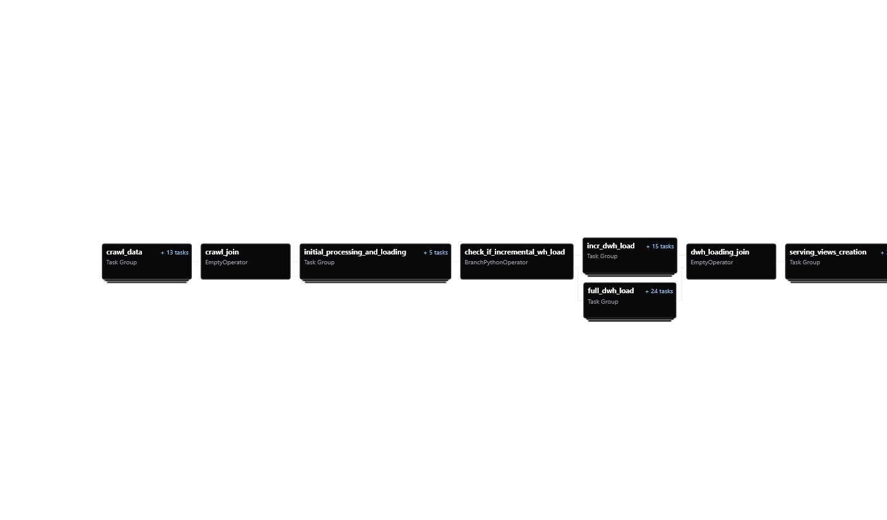

This DAG can run in incremental and full load mode. If incremental is specified, then it crawls fights that happened at most before a specific number of dates(default is 15 days). Also, the pipeline **is scheduled to run incrementally every Monday at 9:30AM**. Since UFC events typically occur weekly, this schedule ensures new fights are ingested shortly after they happen.

### Crawling Workflow

The first part of the pipeline is the crawling part. An illustration of the workflow is shown below:

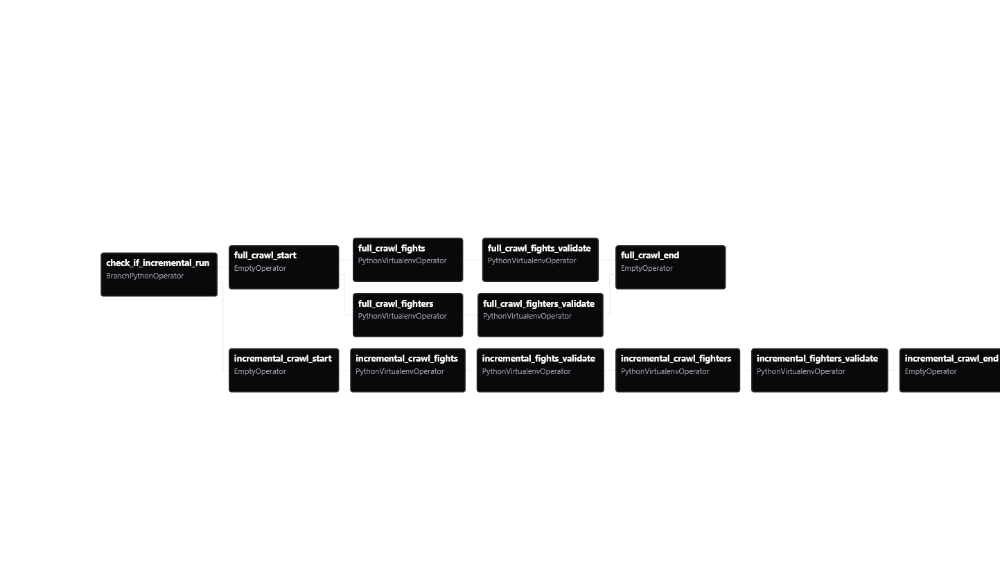

Generally, you can see that there are two different paths. The Incremental one and the Full Loading one where each of them crawls the fighters and fights and does a simple validation afterwards in order to not jump to the processing part blindly. In **incremental** mode the spiders run sequentially because fighter crawling depends on the fights retrieved earlier because I retrieve only the fighters involved in the retrieved fights.

Crawling happens in Scrapyd server which along with ScrapydWeb provides a nice UI to deploy and monitor spiders' runs. The data are saved inside a MinIO Bucket which represents our Data Lake solution.

### Initial Processing & Loading to PostGres Workflow

In this workflow, I'm applying any processing, transformation and cleaning step that is much easier to be done via Python than SQL and load the processing data into my PostGres DB's landing tables. The workflow is shown below:

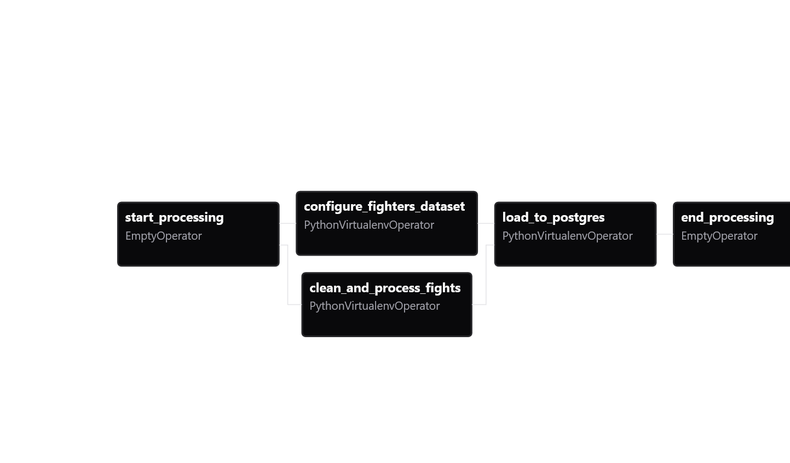

### Full Warehouse Loading Workflow

If the pipeline runs are not incremental, then, it goes to this workflow which applies SQL scripts to build eventually the warehouse tables. The workflow is the following:

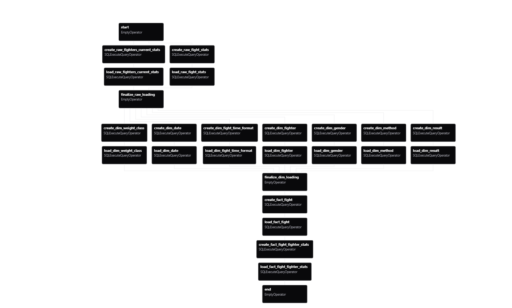

As you can see above, it creates again every table(after dropping it of course) and loads again data to it. Also, it is evident that the loading is structured per layer, which starts from raw layer, then goes to dimensions and finally to create the fact tables.

### Incremental Warehouse Loading Workflow

For incremental runs the Warehouse Loading Workflow is the following:

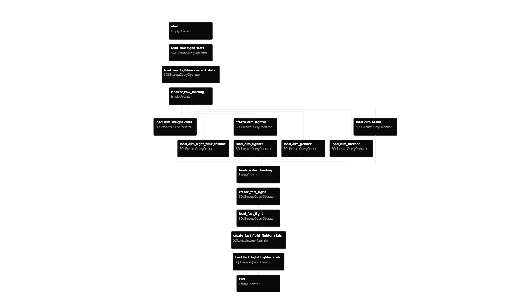

In general, I built it again structured per layer but now each task internally runs a MERGE statement in order to only add new entries. Someone might observe that **DIM_Fighter** and the fact tables are not loaded incrementally. This happens because it's harder to make an incremental loading routine for these tables and also because the tables do not have that many data, incremental loading is not faster in this part than full load. Incremental Loading in fact optimizes crawling which takes almost the whole time for the pipeline to run. The rest of the steps are run almost in no time compared to the crawling one.

### Serving Views Creation Workflow

This workflow currently just creates the necessary views that the Machine Learning scripts can read data from them in the format they want it.

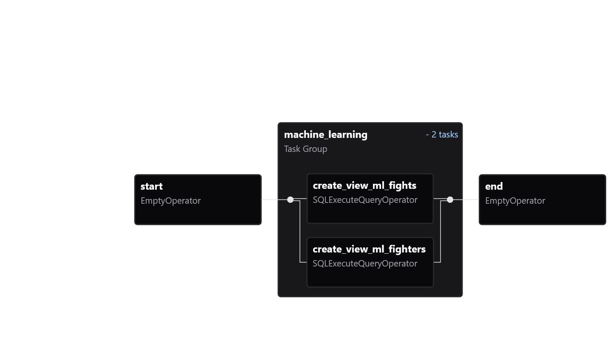

## Reporting

In order to demonstrate a proper usage of my data model-until I build the ML Pipeline-, I decided to build a report with various dashboards. The following dashboards demonstrate how the warehouse can be used to generate insights on fight outcomes and fighter performance.

### Overview Page

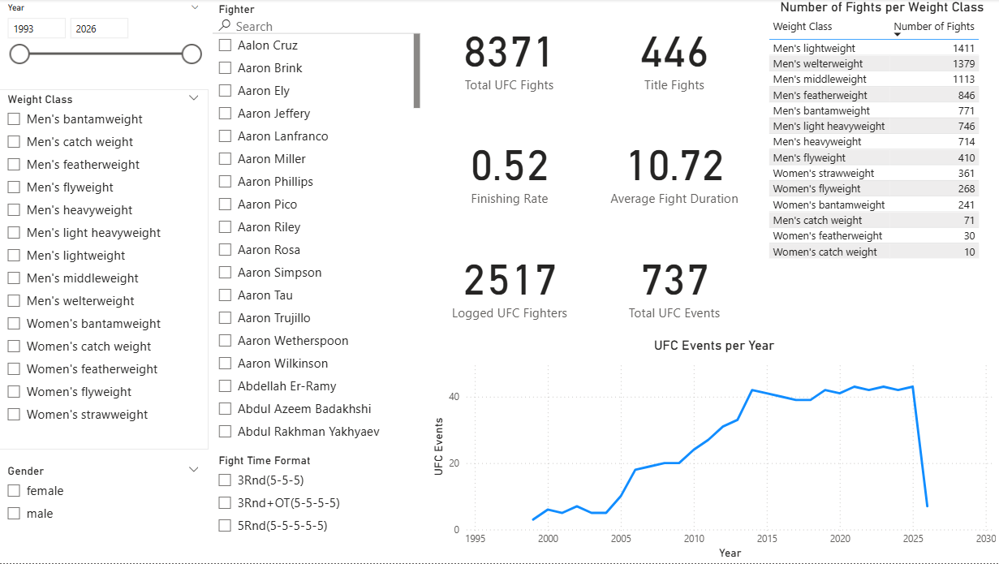

In this page, I demonstrate some simple KPIs and stats like total number of UFC Fights, Events and average fight duration. I also provide the ability through slicers to filter based on year range, weight class, gender, fight time format and fighter. The number of fighters shown is the one that participates to at least 1 UFC Fight. From this page we can derive the following insights:
- 1 of 2 fights ends in a finish,
- UFC seems that started slowly with few events per year. But, from 2009 until 2014 it has conducted more events year after year, until 2014 were it was doing consistently around 40 events in a year.
- If you switch the gender, you can see that 54% of men's fights end in a finish while for women only 36% of their fights ends in a finishing way.
- Men's Lightweight and Welterweight are the ones with the most fights.

### Fighter's Performance Page

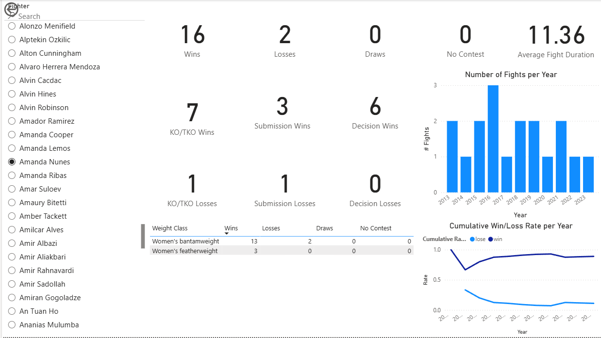

In this page, I demonstrate some stats for the selected fighter, like their Win-Lose-Draw-No Contest record in general and per weight class the fought, how their wins and losses came, their Average Fight Duration in Minutes, their activity level through the years and their win and loss rate through the years.

### Method of Victory Page

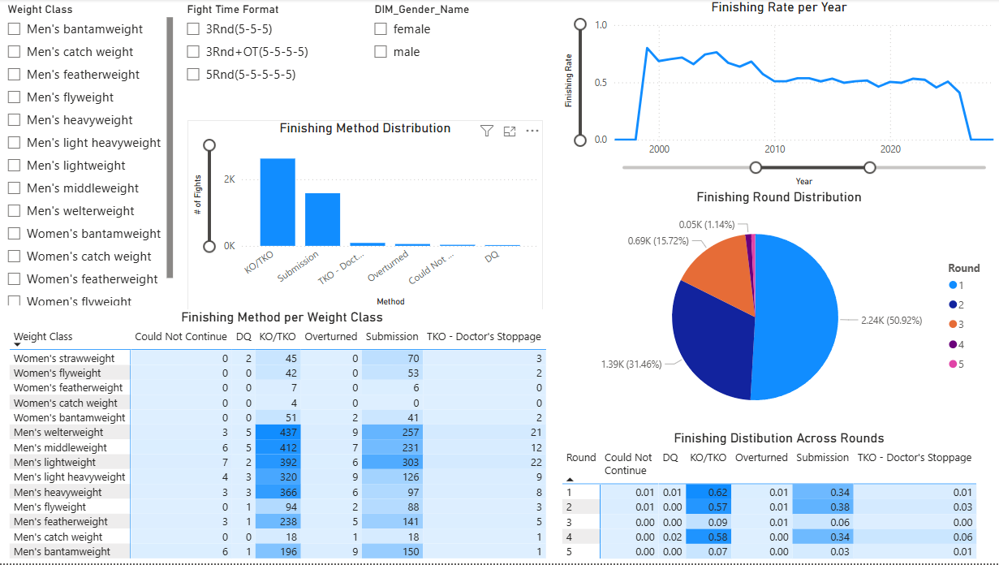

In this report, I analyze around the finishing methods and in fact monitor the finishing rate through the years. Like the Overview report, I also provide slicers in order to analyze across weight class, gender and fight tie format. From this page we can derive the following insights:

- Half of fights that finish before reaching the time limit, are finished in Round 1. If we filter only 5 Round Fights we can see that around 55% of those fights end in rounds 1 or 2.
- After 2010, we can see that finishing rate through the years is around 50%.
- If we use the gender slice, we can see that the most popular method among female fighters is the Submission while for men it is the KO/TKO.
- Men's welterweight seems to be the weight class with most finishers.

## Running the Project

- To start the Docker Infrastructure and also access the services (Airflow, Scrapyd, MinIO, Postgres, MLflow), check [docker/README.md](https://github.com/ManosL/UFC-MMA-Fight-Predictor/blob/master/docker/README.md).
- In order to run the Machine Learning Experiments and Predictor(aka Demo) check [src/machine_learning/README.md](https://github.com/ManosL/UFC-MMA-Fight-Predictor/blob/master/src/machine_learning/README.md).
- For the report, after starting the infrastructure, you should open the **.pbix** file.

## Future Work

### Data Engineering

- Revision Data Model
- Additional features in the warehouse + reflecting them downstream
- Data (Quality) Tests

### Machine Learning

- Build an ML Pipeline utilising also MLflow to log experiments & deploy best model.
- Build a predictor app.
- Model Performance monitoring(this will require Data Engineering work also along with building a PowerBI report).
